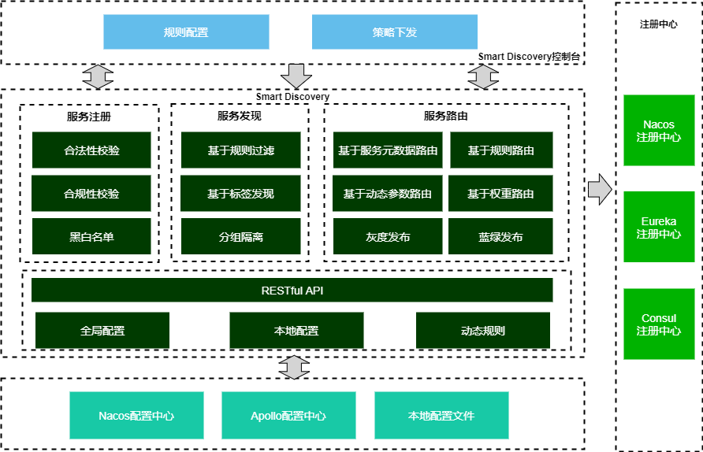

## Smart Discovery简介
### 概述

​	Smart Discovery旨在对SpringCloud服务注册发现功能进行增强，提供一个可基于规则的服务注册发现、路由的智能微服务治理框架，基于此种灵活的规则配置可实现如服务注册校验、分组隔离、权重路由、主机路由、自定义标签路由、动态参数路由、灰度发布、黑白名单等业务场景。同时框架适配了主流的注册中心、配置中心，依托于配置中心的能力实现配置规则的动态下发。

​	开发者只需引入此框架，并做少量规则配置即可享受此框架带来的功能，无代码入侵；另外开发者也可以基于框架提供的扩展机制实现自定义的业务逻辑。更多的信息可以详见 [使用文档](https://github.com/leonside/springleaf-cloud-smart-discovery/wiki)。


### 特性

- 服务注册：通过对注册上来的服务进行校验，如通过对host、服务名称等信息校验，来保障接入服务的合法性、合规性、安全性。
- 服务发现：支持对服务元数据信息（如host、版本信息、自定义标签等）条件过滤，实现如黑白名单、基于版本、标签等服务发现过滤等功能。
- 服务路由：支持对服务元数据信息（如host、版本信息、自定义标签等）条件规则路由；同时支持基于请求参数（如：Header、Request参数）的条件匹配,来实现动态参数路由，并支持SpEL表达式。
- 灰度发布：基于服务路由的功能特性，可实现服务的灰度发布场景，例如可通过服务版本、自定义标签的规则切换，或是匹配请求参数等方式来实现灰度发布。
- 分组隔离：支持通过分组信息的配置，来实现服务分组隔离。
- 服务权重路由：支持服务权重路由，支持全局权重条件配置及接口级别的细粒度权重条件配置，通过权重调整支持蓝绿发布等场景。
- 支持动态配置发布：支持RESTful API、配置中心动态推送等方式实现动态配置发布，默认情况下动态配置优先级高于本地配置，可以作为实现灰度发布能力基础。
- 支持多配置中心：支持主流的配置中心，如Nacos、Apollo，同时考虑更多配置中心接入的扩展性。
- 支持多注册中心：支持主流的注册中心，如Nacos、eureka、consul等。
- 扩展性：框架提供简单易用、完善的扩展机制，开发者可通过扩展接口来快速订制业务逻辑，如自定义条件规则实现、扩展服务注册过滤器、扩展服务路由过滤器等。
- 无代码入侵：开发者只需引入此框架，并做少量规则配置即可享受此框架带来的功能，无代码入侵，零代码。




## Smart Discovery快速入门

### Github示例工程

​     如果希望最快的速度了解Smart Discovery的功能，您可以直接下载[Github上的示例工程](https://github.com/leonside/springleaf-cloud-smart-discovery/tree/master/springleaf-cloud-smart-discovery-samples)并运行，结合配置规则来快速了解Smart Discovery。


### 开发第一个入门例子

> 下面的例子采用Nacos为注册中心，通过基于Smart Discovery实现基于Version版本路由的业务场景，例如：服务消费方只能调用相同版本的服务提供方

#### 步骤1：运行注册中心（Nacos）

参加[Nacos官方文档](https://nacos.io/zh-cn/docs/deployment.html)说明

#### 步骤2：开发服务提供方

> 为了更好模拟基于版本路由的效果，分别启动2个服务提供方，并依次设置版本号v1、v2，端口分别是28081、28082。如下只展现v1版本号的服务提供方示例代码。
>
> 此步骤和正常的SpringCloud开发无差异，对于熟悉SpringCloud开发者可快速浏览此章节。

##### 步骤2.1：引入Maven依赖

> 本示例采用nacos为注册中心，只需额外引入如下POM

 ```
<dependency>
   <groupId>io.github.leonside</groupId>
   <artifactId>springleaf-cloud-smart-discovery-nacos</artifactId>
</dependency>
 ```
注:目前RELEASE分支下的版本均已发布至中央仓库（例如：1.0.0）


##### 步骤2.3：SpringCloud简单示例编写

- 编写SpringBoot  Main函数及Controller

  > 此处只需添加@EnableSmartDiscoveryClient注解，其他只需参照SpringCloud的示例开发即可

  ```
  @SpringBootApplication
  @EnableDiscoveryClient
  @EnableSmartDiscoveryClient
  public class DemoApplicationB1 {
  
      public static void main(String[] args) {
      	//设置spring profile active,主要用于模拟启动多个服务提供方
  		System.setProperty("spring.profiles.active", "b1");
          //System.setProperty("spring.profiles.active", "b2");
  
          SpringApplication.run(DemoApplicationA1.class, args);
      }
  
      @RestController
      public class ServerBController {
  
          @RequestMapping(path = "/demo-b/echo", method = RequestMethod.GET)
          public String echo(@RequestParam("input") String input){
              System.out.println("serverB say: " + input);
              return "serverB say: " + input;
          }
      }
  }
  ```

  **注：为模拟多个服务提供方，此处通过设置设置spring profile active，其中DemoApplicationB1对应的Spring配置文件名为application-a1.yml**


- 编写application-a1.yml配置文件

> 同样，此处配置只需按照SpringCloud说明正常开放即可

```
server:
  port: 28080
spring:
  application:
    name: demo-b
  cloud:
    nacos:
      discovery:
        server-addr: localhost:8848
        metadata:  #配置更多的服务元数据，smart discovery基于此元数据进行路由（此示例中基于version路由）
          version: 1.0
 #         region: dev
 #         tag: tag1
```


- 启动DemoApplicationB1服务提供方

运行DemoApplicationB1  main函数，出现如下提示说明启动成功

```
2021-10-05 16:35:12.663  INFO 24632 --- [           main] o.s.b.a.e.web.EndpointLinksResolver      : Exposing 20 endpoint(s) beneath base path '/actuator'
2021-10-05 16:35:12.857  INFO 24632 --- [           main] o.s.b.w.embedded.tomcat.TomcatWebServer  : Tomcat started on port(s): 28080 (http) with context path ''
2021-10-05 16:35:12.976  INFO 24632 --- [           main] o.s.c.a.n.registry.NacosServiceRegistry  : nacos registry, demo-b 192.168.75.1:28080 register finished
2021-10-05 16:35:12.979  INFO 24632 --- [           main] c.s.c.d.controller.DemoApplicationB1     : Started DemoApplicationB1 in 10.461 seconds (JVM running for 12.625)
2021-10-05 16:35:14.052  INFO 24632 --- [n(2)-10.11.1.14] o.a.c.c.C.[Tomcat].[localhost].[/]       : Initializing Spring DispatcherServlet 'dispatcherServlet'
2021-10-05 16:35:14.052  INFO 24632 --- [n(2)-10.11.1.14] o.s.web.servlet.DispatcherServlet        : Initializing Servlet 'dispatcherServlet'
2021-10-05 16:35:14.084  INFO 24632 --- [n(2)-10.11.1.14] o.s.web.servlet.DispatcherServlet        : Completed initialization in 32 ms
```

同上，继续开发服务DemoApplicationB1 、application-b2.yml，并设置版本号为v2（略）。


#### 步骤3：开发服务消费方

> 区别于服务提供方，此处增加了SmartDiscovery的服务发现规则配置（基于版本号服务发现），其他代码开发和正常的SpringCloud开发无差异。

##### 步骤3.1：引入Maven依赖

> 同上，只需额外引入如下POM

 ```
<dependency>
   <groupId>io.github.leonside</groupId>
   <artifactId>springleaf-cloud-smart-discovery-nacos</artifactId>
</dependency>
 ```


##### 步骤3.2：SpringCloud简单示例编写

- 编写SpringBoot  Main函数及Controller

  >只需添加@EnableSmartDiscoveryClient注解，其他按照SpringCloud的正常的开发示例，开发服务消费方。
  >
  >为简单起见，此处采用RestTemplate方式调用，当然也可以采用Feign方式调用。

```
@SpringBootApplication
@EnableDiscoveryClient
@EnableFeignClients
@EnableSmartDiscoveryClient
public class DemoApplicationA1 {

    public static void main(String[] args) {
        SpringApplication.run(DemoApplicationA1.class, args);
    }

    @Bean
    @LoadBalanced
    public RestTemplate restTemplate(){
        return new RestTemplate();
    }

    @RestController
    @RequestMapping("demo-a")
    public class ServerAController {

        @Autowired
        private RestTemplate restTemplate;

        @RequestMapping(path = "/router/rule1", method = RequestMethod.GET)
        public String rule1(@RequestParam("input") String input){

            System.out.println("server a say: " + input);
            String echo = restTemplate.getForObject("http://demo-b/demo-b/echo?input=" + input, String.class);
            return "serverA say: " + echo;
        }
    }
}
```


##### 步骤3.3：SmartDiscovery服务发现规则配置

- 配置服务发现条件规则

  > 本示例采用本地JSON配置文件的方式，在resources目录下新建discovery-rule-discovery.json规则配置文件，配置如下：

  ```yaml
  [
    {
      "serviceId": "demo-a",
      "force": true,
      "priority": 0,
      "conditions": " => version = $version", 
      "enabled": true
    }
  ]
  ```

  其中conditions规则含义：服务提供方的版本号等于服务消费方的版本号，具体规则说明见条件规则详解章节。


- 配置Spring application.yml配置

```yaml
server:
  port: 18080
spring:
  application:
    name: demo-a
  cloud:
    nacos:
      discovery:
        server-addr: localhost:8848
        metadata:  #配置更多的服务元数据，smart discovery基于此元数据进行路由（此示例中基于version路由）
          version: 1.0
 #         region: dev
 #         tag: tag1
springleaf:
  smart:
    discovery:
      router:
        config:
          file:
            file: classpath:discovery-rule-discovery.json  #采用file配置方式，并指定配置文件路径，更多参见规则配置说明章节
            
logging:
  level:
    com:
      springleaf: debug   #为方便验证结果，打印smart discovery日志
```

另外，得益于Spring的 spring-configuration-metadata 功能，针对框架相关的参数配置在idea开发环境下都可以通过诱导提示,包含参数说明、是否必填、示例等信息，如下：


##### 步骤3.4：运行并验证结果

> 运行DemoApplicationA1主函数，并调用http://localhost:18080/demo-a/router/rule1?input=123
>
> 查看服务消费方的控制台的输出日志：

```
2021-10-05 17:23:33.364 DEBUG 32608 --- [erListUpdater-0] f.s.LoadBalanceServerListConditionFilter : [Discovery filtering] List of Servers for demo-a obtained from Discovery client: [192.168.75.1:28080] ,The service before filtering is :[192.168.75.1:28081, 192.168.75.1:28080]
```

同时查看服务提供方的控制台日志，查看具体是哪个提供方被调用。

经过多次调用，发现始终都是调用版本号是v2的demo-b服务提供方(即端口号是28081)，由此可见，smart discovery帮助我们实现了服务消费方只能调用相同版本的服务提供方的业务场景。

## 写在最后
Smart Discovery是在总结工作项目中使用SpringCloud遇到的诉求，利用工作之外的业余时间编写的，难免会有些不完善的地方欢迎指正。另外，Smart Discovery框架如果对你有帮助的话也请点个赞，这是对我最大的鼓励！