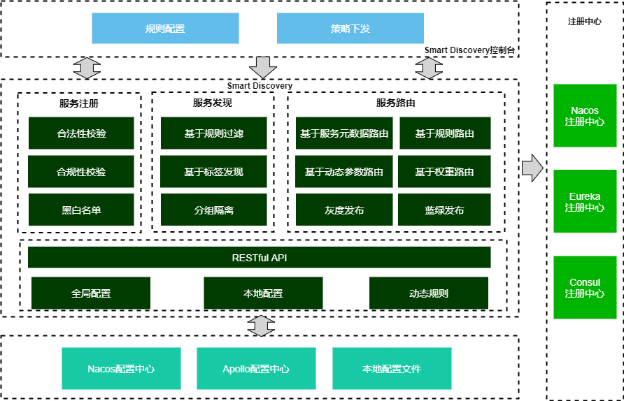


## Smart Discovery简介
### 概述

​	Smart Discovery旨在对SpringCloud服务注册发现功能进行增强，提供一个可基于规则的服务注册发现、路由的智能微服务治理框架，基于此种灵活的规则配置可实现如服务注册校验、分组隔离、权重路由、主机路由、自定义标签路由、动态参数路由、灰度发布、黑白名单等业务场景。同时框架适配了主流的注册中心、配置中心，依托于配置中心的能力实现配置规则的动态下发。

​	开发者只需引入此框架，并做少量规则配置即可享受此框架带来的功能，无代码入侵；另外开发者也可以基于框架提供的扩展机制实现自定义的业务逻辑。

### 特性

- 服务注册：通过对注册上来的服务进行校验，如通过对host、服务名称等信息校验，来保障接入服务的合法性、合规性、安全性。
- 服务发现：支持对服务元数据信息（如host、版本信息、自定义标签等）条件过滤，实现如黑白名单、基于版本、标签等服务发现过滤等功能。
- 服务路由：支持对服务元数据信息（如host、版本信息、自定义标签等）条件规则路由；同时支持基于请求参数（如：Header、Request参数）的条件匹配,来实现动态参数路由，并支持SpEL表达式。
- 灰度发布：基于服务路由的功能特性，可实现服务的灰度发布场景，例如可通过服务版本、自定义标签的规则切换，或是匹配请求参数等方式来实现灰度发布。
- 分组隔离：支持通过分组信息的配置，来实现服务分组隔离。
- 服务权重路由：支持服务权重路由，支持全局权重条件配置及接口级别的细粒度权重条件配置，通过权重调整支持蓝绿发布等场景。
- 支持动态配置发布：支持RESTful API、配置中心动态推送等方式实现动态配置发布，默认情况下动态配置优先级高于本地配置，可以作为实现灰度发布能力基础。
- 支持多配置中心：支持主流的配置中心，如Nacos、Apollo，同时考虑更多配置中心接入的扩展性。
- 支持多注册中心：支持主流的注册中心，如Nacos、eureka、consul等。
- 扩展性：框架提供简单易用、完善的扩展机制，开发者可通过扩展接口来快速订制业务逻辑，如自定义条件规则实现、扩展服务注册过滤器、扩展服务路由过滤器等。
- 无代码入侵：开发者只需引入此框架，并做少量规则配置即可享受此框架带来的功能，无代码入侵，零代码。

## 写在最后
Smart Discovery是在总结工作项目中使用SpringCloud遇到的诉求，利用工作之外的业余时间编写的，难免会有些不完善的地方欢迎指正。另外，Smart Discovery框架如果对你有帮助的话也请点个赞，这是对我最大的鼓励！

